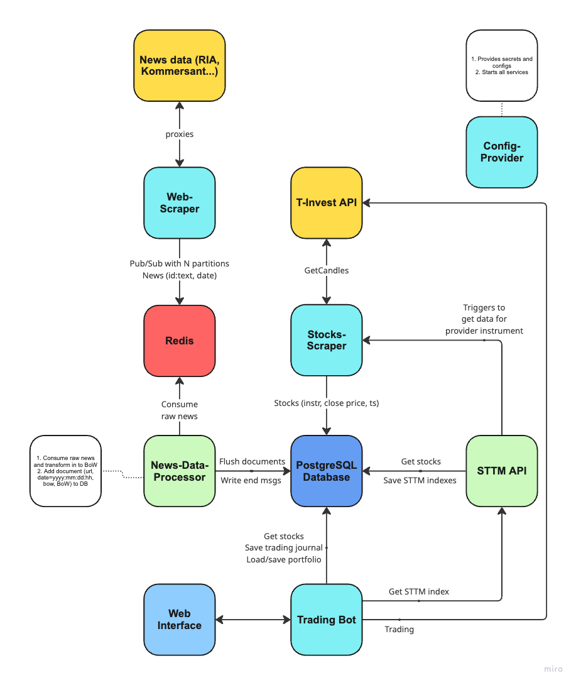

# STTM NSU - Stock Tonal Topic Modeling

Our goal is to provide convenient way to get STTM index and make trades with it.

## Services

This article contains services definitions.

### config-provider

Entrypoint of entire system
- Provides configs and secrets for all services
- Starts services using docker-compose
- Applies migrations to DB

### web-scraper

- Scraps news (e.g. RIA, Kommersant) data from certain date to now and pushes this data to Redis Pub/Sub "queue".
  - When consumed all data for current time (e.g. morning news), then waits some time to continue consuming for new data.
- When all news on some day have been retrieved, sends special message to mark day as "done".

General message format (where `date` field has RFC3399 format but without minutes and less time units):
```json
{
  "url": "example-url.example",
  "date": "yyyy:mm:dd:hh", 
  "text": "raw news data"
}
```

End message have general message format. but has `stop` word in `"url"` field.

### news-data-processor

_Written on Python_

- Consumes message from Redis Pub/Sub
- Makes data preprocessing:
  - Tokenization, lemmatization
  - Removal of stop-words, non-alphabetic (e.g. punctuation symbols) and non-Cyrillic words
  - Makes bag-of-words representation of document
- Pushes data to DB
- When got end message from web-scraper, it waits until all data processing for this day will be done, and
writes message `(date, ready)` to DB.

### stocks-scraper

- Scraper start scrap stocks for provided `instruments_id` list.
  - It saves prices to stocks table (`instrument_id`, `ts`, `close_price`) in DB.
  - Also saves instrument ids and first candles occurrences dates to instruments table.
- Scraper also has own API.
    - `GET /check?instrument_id=example` - checks whether `instrument_id` stocks are fullfilled or not.
      (returns json `{"ok":true, "exist":true}`, where `ok` means ready to use and `exist` tells about instrument existence in scraper)
    - `POST /scrap?instrument_id=example&cmd=add` - add or delete instrument_id to/from scraping. (cmd can be `delete` or `add`)

### STTM API

_Written on Python_

Main goal is to provide STTM index for some interval of time and instrument
- `GET /get-index?instrument_id=1&from=2&to=3&alpha=4&p_value=5&threshold=6` - provides STTM index for:
  - `instrument_id` - FIGI of the instrument
  - `from`, `to` - dates intervals (must be at least one day)
  - STTM hyperparameters:
    - `alpha` - **alpha**-level of upper and lower quantiles for removing words from the preprocessed text data
    - `p_value` - if **p_value** after calculation of Pearson correlation is greater or equal to it parameter then
    correlation coefficient will be equal to zero
    - `threshold` - defines `threshold` for sum of most probable words for topic tone function

Algorithm:
- Validate input parameters
  - Date interval must be at least one day
- Check if STTM index already was calculated for certain parameters, if so then return it from DB
- Check stocks availability from stocks-scraper, if so then get it from DB
  - If not - do `GET /check` to stocks-scraper and wait or start scraping for some new instrument, then wait till completion
- Check news data documents availability in special table from DB, if so then get news from DB for interval
  - If not - wait for availability from DB special table
- Requests LDA entity for topic modeling for certain interval
- Calculates STTM index, saves it to DB and responses with it

Interpretability features:
- For each STTM index calculation it saves:
  - Topics number to string representation mapping with choosing the most probable word in every distribution
  - TTS (tonal topic stream) matrix where rows are topics and columns are time units, so every element of the matrix
  represents **i** topic tonality for some **j** time unit

#### Latent Dirichlet Allocation algorithm.

- Tries to get month large data for online training eventually
    - Retrieves and filters news BoWs by calculating of IDF (inverse document frequency) and removing lower and higher quantiles
      of config `alpha` level, after that it merges separate BoW documents into one and update LDA model
- If someone requests topic modeling for some interval (and some `alpha` level) of time then:
    - Check for existence of news data for provided interval
    - Retrieves and filters news BoWs by calculating of IDF (inverse document frequency) and removing lower and higher quantiles
      of config `alpha` level, after that it merges separate BoW documents into one
    - Retrieves topic probability distribution for every document (news data bag-of-words) for each time unit
    - Also retrieves words probability distribution for each topic and time unit

### trading-bot

The highest efficiency of the STTM index is achieved in the interval between trades.

Because of Effective market hypothesis (all publicly available information is immediately and fully reflected in stock market prices)
we can make decisions based on news and stocks price only when market is not working, so we can take advantage of it.

So to detect these intervals it's needed to:
- Check trading schedule for some instrument
    - Get exchange for some `instrument_id`
    - Get exchange trading schedule for provided instrument to check trades ending

In order to use the STTM index bot trades using this strategy:
- Trading bot operates with certain portfolio of instruments, so it calculates STTM indexes for each on certain interval
  - It requests STTM API for each instrument and waits till every value will be retrieved
- It selects top N percent of instruments with the highest value of the index
- Filters instrument with STTM index less than some threshold
- Then several options for each STTM top instrument is available
  - If instrument was in portfolio but in new top it didn't appear so it's need to send it with stop-loss or stop-market order
  - If instrument was in portfolio and appeared in new top then we sell it with take-profit order
    - Or if flag is provided than we don't sell this instrument and continue keep for next STTM calculation
  - Other instruments which appeared in STTM top we buy with limit or market order
  - Before selling we calculate desired amount of instruments to buy, considering:
    - Trading bot account balance
    - Proposed selling instruments price (with some sort of protection)
    - Quantity of each instrument (we can buy approximately equal amounts or growing amount - instrument with the highest index value will get the largest amount)

Like that we provide diversification (portfolio rebalancing)

At the start trading bot tries to get existing portfolio in DB but if not then it tries to make one iteration of rebalancing:
- For full-fledged work it's needed to have:
  - `T_INVEST_API_TOKEN` to communicate with broker
  - Amount of money (quantity and currency) that trading bot is allowed to use
  - Instruments list (ISIN, FIGI, ticker_classcode) with which robot will operate, or instruments type to search for the best
  through all over the market
  - Top instruments percent (for portfolio rebalancing)
  - Type of lots balancing when rebalance happens (equal or growing quantities between top STTM instruments)
  - STTM index threshold
  - STTM calculation interval (day or week (actually 5 days))
  - Technical indicators configs
  - Orders parameters:
    - Type of order when sell out gone from the index instruments: stop-loss or stop-market with percent params from current price on market
    - Behaviour on keeping in STTM top for the second time: sell with take-profit or keep until it leaves the top
    - So for take-profit it also needed to have percent parameters
    - In order to buy stocks we can use market or limit orders
      - For limit order it's needed to specify indent from current price on market not in profitable way for more likely purchase
    - It's also possible to pass percent indent from inital price for hedging and placing orders

For safety nets (all profits are achieved by diversifying using the STTM index) we use technical indicators such as:
- RSI (relative strength index) + Bollinger Bands:
  - Sell or don't buy if RSI > X and price is higher than the upper Bollinger band
  - Don't sell if RSI < Y and price is lower than the lower Bollinger band
  - Params for that indicator: X, Y (intervals for hour candles)
- EMA (exponential moving average) + MACD (moving average convergence/divergence)
  - If EMA(X) < EMA(Y) where X < Y and MACD(X, Y, signal_smoothing) < 0 then sell instruments
  - Params for that indicator: X, Y (intervals for hour candles)


