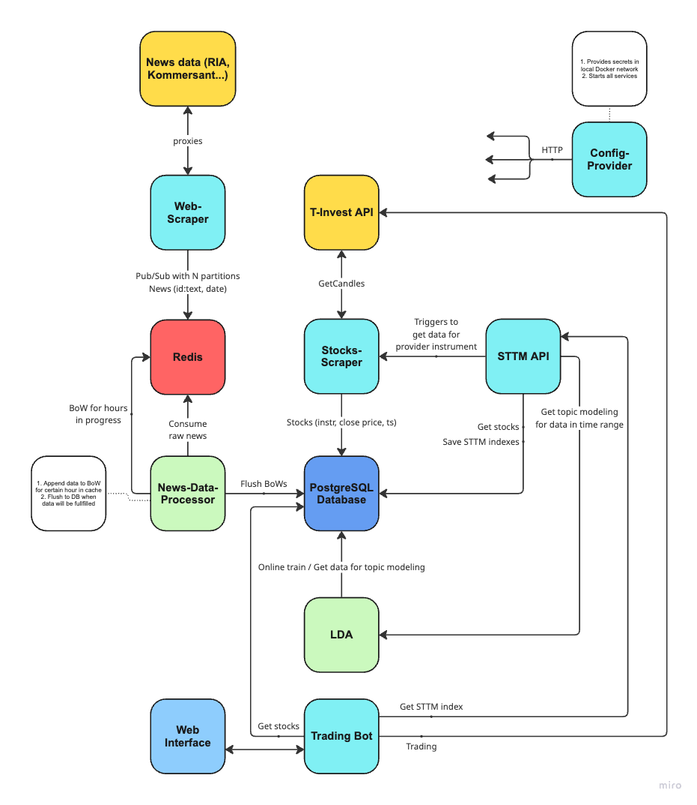

# STTM NSU - Stock Tonal Topic Modeling

Our goal is to provide convenient way to get STTM index and make trades with it.

## Services

This article contains services definitions.

### config-provider

Entrypoint of entire system
- Provides configs and secrets for all services
- Starts services using docker-compose
- Applies migrations to DB

### web-scraper

- Scraps news (e.g. RIA, Kommersant) data from certain date to now and pushes this data to Redis Pub/Sub "queue".
  - When consumed all data for current time (e.g. morning news), then waits some time to continue consuming for new data.
- When all news on some day have been retrieved, sends special message to mark day as "done".

General message format:
```json
{
  "url": "example-url.example",
  "date": "yyyy:mm:dd:hh", // RFC3399 format but without minutes and less time units
  "text": "raw news data"
}
```

End message have general message format. but has `stop` word in `"url"` field.

### news-data-processor

_Written on Python_

- Consumes message from Redis Pub/Sub
- Makes data preprocessing:
  - Tokenization, lemmatization
  - Removal of stop-words, non-alphabetic (e.g. punctuation symbols) and non-Cyrillic words
  - Makes bag-of-words representation of document
- Pushes data to DB
- When got end message from web-scraper, it waits until all data processing for this day will be done, and
writes message `(date, ready)` to DB.

### stocks-scraper

- Scraper start scrap stocks for provided `instruments_id` list.
  - It saves prices to stocks table (`instrument_id`, `ts`, `close_price`) in DB.
  - Also saves instrument ids and first candles occurrences dates to instruments table.
- Scraper also has own API.
    - `GET /check?instrument_id=example` - checks whether `instrument_id` stocks are fullfilled or not.
      (returns json `{"ok":true, "exist":true}`, where `ok` means ready to use and `exist` tells about instrument existence in scraper)
    - `POST /scrap?instrument_id=example&cmd=add` - add or delete instrument_id to/from scraping. (cmd can be `delete` or `add`)

### STTM API

_Written on Python_

Main goal is to provide STTM index for some interval of time and instrument
- `GET /get-index?instrument_id=1&from=2&to=3&alpha=4&p_value=5&threshold=6` - provides STTM index for:
  - `instrument_id` - FIGI of the instrument
  - `from`, `to` - dates intervals (must be at least one day)
  - STTM hyperparameters:
    - `alpha` - **alpha**-level of upper and lower quantiles for removing words from the preprocessed text data
    - `p_value` - if **p_value** after calculation of Pearson correlation is greater or equal to it parameter then
    correlation coefficient will be equal to zero
    - `threshold` - defines `threshold` for sum of most probable words for topic tone function
Algorithm:
- Validate input parameters
  - Date interval must be at least one day
- Check if STTM index already was calculated for certain parameters, if so then return it from DB
- Check stocks availability from stocks-scraper, if so then get it from DB
  - If not - do `GET /check` to stocks-scraper and wait or start scraping for some new instrument, then wait till completion
- Check news data documents availability in special table from DB, if so then get news from DB for interval
  - If not - wait for availability from DB special table
- Requests LDA entity for topic modeling for certain interval
- Calculates STTM index, saves it to DB and responses with it

#### Latent Dirichlet Allocation algorithm.

- Tries to get month large data for online training eventually
    - Retrieves and filters news BoWs by calculating of IDF (inverse document frequency) and removing lower and higher quantiles
      of config `alpha` level, after that it merges separate BoW documents into one and update LDA model
- If someone requests topic modeling for some interval (and some `alpha` level) of time then:
    - Check for existence of news data for provided interval
    - Retrieves and filters news BoWs by calculating of IDF (inverse document frequency) and removing lower and higher quantiles
      of config `alpha` level, after that it merges separate BoW documents into one
    - Retrieves topic probability distribution for every document (news data bag-of-words) for each time unit
    - Also retrieves words probability distribution for each topic and time unit

### trading-bot

- Checks trading schedule for some instrument
    - Get exchange for some `instrument_id` (FIGI) of instrument
    - Get exchange trading schedule for provided


